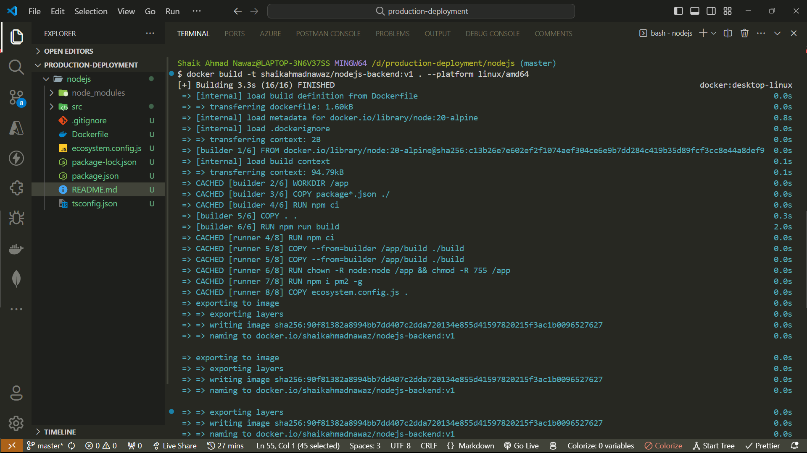
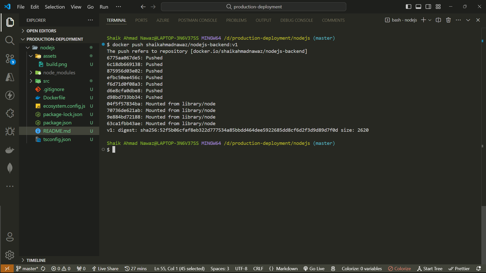
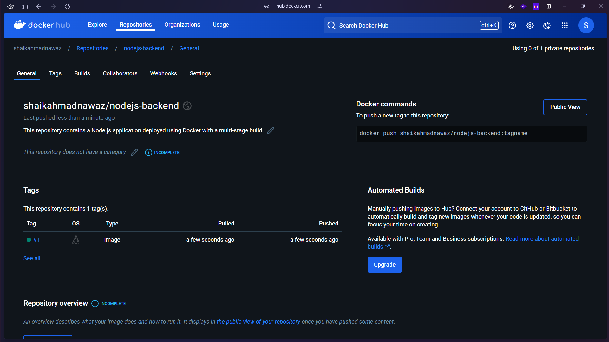

# Node.js Production Deployment with Docker

This repository contains a Node.js application deployed using Docker with a multi-stage build process. The goal is to create an optimized production image using Alpine Linux and PM2 as the process manager.

## Prerequisites

- Docker installed on your machine.
- Node.js and npm (for local development, if needed).

## Features

- **Multi-stage Docker build**: The application is built in one stage (`builder`) and then only the production code is copied to the final image, reducing image size.
- **PM2 Process Manager**: The application is run using PM2 to ensure continuous availability and manage multiple instances.
- **Non-root user**: The application runs as the `node` user for added security.

## Dockerfile Breakdown

1. **Builder Stage**:

   - Uses `node:20-alpine` for lightweight builds.
   - Installs dependencies and builds the Node.js app.

2. **Final Production Stage**:
   - Uses `node:20-alpine`.
   - Installs only production dependencies.
   - Copies the built app from the builder stage.
   - Runs the app using PM2 with the `ecosystem.config.js` file.

## Build and Run the Docker Image

### 1. Build the Docker Image

To build the Docker image for your application, run the following command:

```bash
docker build -t shaikahmadnawaz/nodejs-backend:v1 . --platform linux/amd64
```



`docker image ls` will show the newly created image:

```bash
REPOSITORY                     TAG       IMAGE ID       CREATED          SIZE
shaikahmadnawaz/nodejs-backend v1        1a2b3c4d5e6f   1 minute ago    100MB
```

If we hasent used multistage build then the image size would be around 1GB.

### 2. Push the Docker Image to Docker Hub

If you want to push the image to Docker Hub, you can tag it with your Docker Hub username and push it:

Before pushing the image to Docker Hub, you need to login to Docker Hub using `docker login` command.

```bash
docker push shaikahmadnawaz/nodejs-backend:v1
```





### 3. Run the Docker Container

Once the image is built, you can run it in a Docker container:

```bash
docker run -d -p 5000:5000 shaikahmadnawaz/nodejs-backend:v1
```

This maps the container's port `5000` to your local machine's port `5000`.

### 3. Stop the Docker Container

To stop the running container, first find the container ID using:

```bash
docker ps
```

Then, stop it using:

```bash
docker stop <container_id>
```

### 4. Docker Compose (Optional)

If you want to manage multiple containers or services, you can add a `docker-compose.yml` file to orchestrate your services.

## Environment Variables

The following environment variables can be set to configure the Node.js environment:

- `NODE_ENV`: Set to `production` in the Dockerfile to install only production dependencies.

## Application Monitoring with PM2

- The app is managed using PM2, a process manager for Node.js applications, which handles restarts and clustering.
- The `ecosystem.config.js` file defines how PM2 runs the application, including the number of instances.

## Exposed Ports

- **5000**: The application is served on port `5000`. You can access it by visiting `http://localhost:5000` after running the container.

## Notes

- Make sure the `ecosystem.config.js` file is properly configured for PM2 to handle the process management.
- The build artifacts (from `npm run build`) are copied into the production image, so ensure your build process generates the necessary output files.
